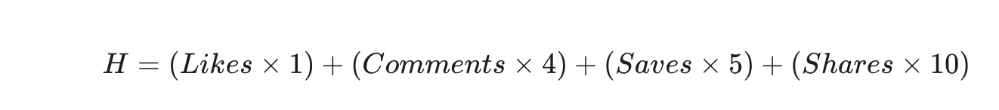
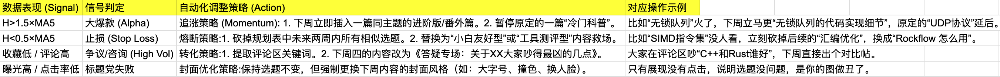
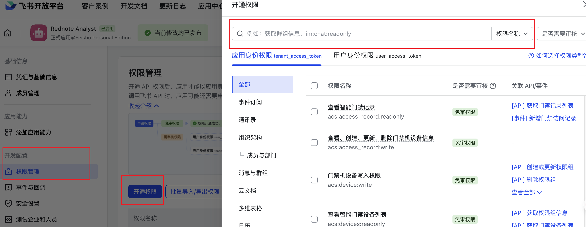
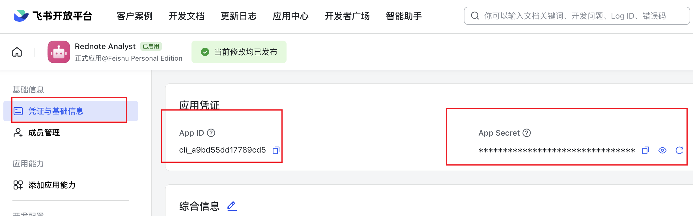
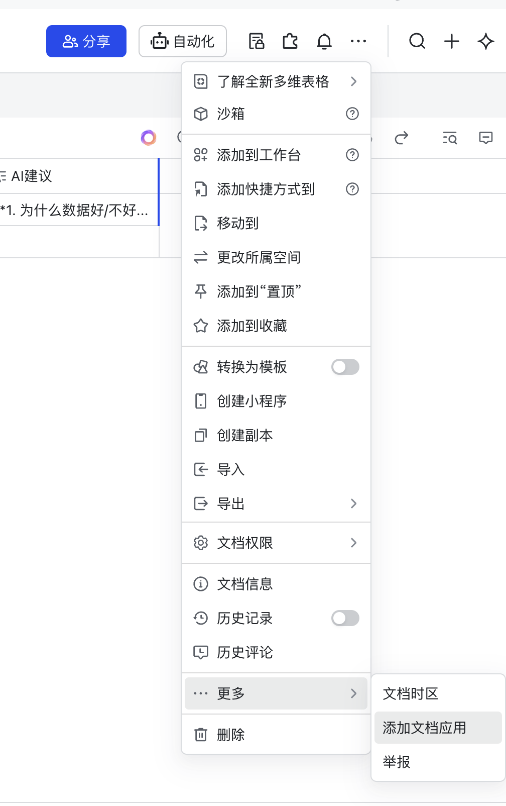

# rednote-agent📕

[](https://github.com/shuheng-mo/rednote-agent/actions/workflows/daily-analysis.yml)
[](https://github.com/shuheng-mo/rednote-agent/actions/workflows/tests.yml)
[](https://opensource.org/licenses/MIT)
[](https://www.python.org/downloads/release/python-3110/)

这是一个基于量化因子构建思维和LLM策略的小红书内容分析工具。

## 构建思路

1. **数据准备**：从小红书导出历史帖子数据，保存为 `post_data_sample.csv`类似的格式，可根据你需要的格式更改，或者定制为特定的输入方式（比如飞书多维表格）。
2. **构建因子**：根据小红书运营经验，设计一套量化因子（如标题吸引力、内容质量、互动率等），并编写代码计算每个帖子的因子得分。
    本工具使用的自定义因子基于小红书的CES（Content Engagement Score）算法进行设计的**干货帖热度指数**:

    取我最近5 篇笔记的 $H$ 值移动平均线 ($MA_5$) 作为参考标准，计算每篇笔记的 $H$ 值与 $MA_5$ 的比值，得出该笔记的相对表现评分。并依据这个让AI来给出对应的建议。
3. **自动化决策矩阵**：
    逻辑如下：

根据这个逻辑，指导AI如何分析内容并给出建议，或进行后续的操作。

4. **AI分析**：调用OpenAI、Gemini或其他兼容API，使用预定义的提示词对帖子内容进行分析，生成量化因子评分和优化建议，并写回数据文件或飞书多维表格，或者你需要的地方例如电子邮件之类。

## 安装和使用

### 1. 设置Python虚拟环境

```bash
python3 -m venv venv
source venv/bin/activate  # macOS/Linux
# 或在 Windows 上使用: venv\Scripts\activate
```

### 2. 安装依赖

```bash
pip install -r requirements.txt
```

### 3. 配置API密钥

编辑 `.env` 文件，将 `YOUR_API_KEY` 替换为您的实际API密钥：

```env
OPENAI_API_KEY=你的实际API密钥
OPENAI_BASE_URL=https://api.moonshot.cn/v1
```

请根据你的实际API提供商调整 `OPENAI_BASE_URL`并按官方文档填写。

### 4. 运行部署

#### 本地运行方式

```bash
# 使用QuantContentAgent进行本地分析
source venv/bin/activate # 可替换为别的虚拟环境工具

# 方式1: 在Python脚本中导入使用
# from agent import QuantContentAgent
# agent = QuantContentAgent("post_data_sample.csv")
# result = agent.run_review(post_data, comments)

# 方式2: 运行单元测试验证功能
python test/run_tests.py
```

#### 在线部署 --飞书+Github Action（推荐）

> 飞书多维表格输入

- 在飞书里新建一个，命名为“小红书运营XXX”。
  - 设计字段：
  - 标题 (文本)
  - 点赞 (数字)
  - 评论 (数字)
  - 收藏 (数字)
  - 状态 (单选: 待分析 / 已分析)
  - AI建议 (文本 - 用于回写结果)
- 获取 API 凭证：
  - 去[飞书开放平台](https://open.feishu.cn/) 创建一个企业自建应用。
  - 权限管理：开通`bitable:app:read (多维表格读取)` 和`bitable:app` (多维表格编辑)。
  
  - 发布版本：创建版本并发布（这一步必须做）。
  - 记录信息：记下 `App ID` 和 `App Secret`。
  
- 获取表格 ID：在多维表格 URL 中找到 `appxxxxxx` (App Token) 和 `tblxxxxxx` (Table ID)。
  - ⚠️注意：飞书表格的URL格式为 `https://ai.feishu.cn/base/XXX?table=XXX&view=XXX`，其中 `base/`到`?`是 App Token，`table=`后的内容是Table ID。
- 在多维表格中添加应用:
  - 打开您的多维表格
  - 点击右上角的 "..." 按钮
  - 选择 "更多" → "添加文档应用"
  - 搜索您的应用名称
  - 点击添加，并给予 "可管理" 权限，这样可以避免403错误
  

> Github Action 配置

- 在仓库点击 `Settings` -> `Secrets and variables` -> `Actions`。
- 添加以下 Repository secrets（即代码中对应的密钥）：
  - `GEMINI_API_KEY`
  - `FS_APP_ID`
  - `FS_APP_SECRET`
  - `FS_APP_TOKEN`
  - `FS_TABLE_ID`
- 创建 Workflow 文件： 在仓库根目录创建 `.github/workflows/daily-analysis.yml`：

    ```yaml
    name: Daily RedNote Analysis

    on:
      schedule:
        # 每天早上9点运行 (UTC时间1点 = 北京时间9点)
        - cron: '0 1 * * *'
      workflow_dispatch: # 允许手动触发

    jobs:
      analyze-rednote:
        runs-on: ubuntu-latest
        
        steps:
        - name: Checkout code
          uses: actions/checkout@v4

        - name: Set up Python
          uses: actions/setup-python@v5
          with:
            python-version: '3.11'

        - name: Cache dependencies
          uses: actions/cache@v4
          with:
            path: ~/.cache/pip
            key: ${{ runner.os }}-pip-${{ hashFiles('**/requirements.txt') }}
            restore-keys: |
              ${{ runner.os }}-pip-

        - name: Install dependencies
          run: |
            python -m pip install --upgrade pip
            pip install -r requirements.txt

        - name: Run RedNote analysis
          env:
            # Gemini API配置
            GEMINI_API_KEY: ${{ secrets.GEMINI_API_KEY }}
            
            # 飞书多维表格配置
            FS_APP_ID: ${{ secrets.FS_APP_ID }}
            FS_APP_SECRET: ${{ secrets.FS_APP_SECRET }}
            FS_APP_TOKEN: ${{ secrets.FS_APP_TOKEN }}
            FS_TABLE_ID: ${{ secrets.FS_TABLE_ID }}
            
            # 可选：用户访问令牌
            FS_USER_ACCESS_TOKEN: ${{ secrets.FS_USER_ACCESS_TOKEN }}
          run: |
            echo "开始运行小红书内容分析..."
            python cloud_agent_runner.py
            echo "分析完成!"

        - name: Upload logs
          if: failure()
          uses: actions/upload-artifact@v4
          with:
            name: error-logs
            path: |
              *.log
              /tmp/*.log
            retention-days: 7
    ```

将上述内容保存后，GitHub Actions 会根据设定的时间表自动运行，分析飞书多维表格中的小红书帖子数据，并将AI建议写回表格供你查看。在此基础上可以根据回写的结论进行改进操作，或者构建飞书图表等等。

## 文件说明

- `agent.py`: 核心分析类 `QuantContentAgent`，提供本地内容分析功能
- `cloud_agent.py`: 云端分析类 `CloudQuantAgent` 和飞书连接器 `FeishuConnector`
- `post_data_sample.csv`: 历史帖子数据样本文件
- `.env`: API配置文件（需要手动配置API密钥）
- `requirements.txt`: Python依赖列表
- `test/`: 完整的单元测试套件（46个测试用例）
- `resources/`: 资源文件夹，包含图片等辅助材料

## 测试

项目包含完整的单元测试套件，覆盖所有主要功能：

```bash
# 运行所有测试
python test/run_tests.py

# 运行特定测试模块
python test/run_tests.py agent           # 核心功能测试
python test/run_tests.py cloud_agent     # 云端组件测试
python test/run_tests.py integration     # 集成测试
```

详细测试文档请查看 [`test/README.md`](test/README.md)。

## 注意事项

- 请确保 `post_data.csv` 文件存在且包含必要的列数据
- API密钥请妥善保管，不要提交到git
- 主要逻辑类不包含main函数，需要通过导入使用或创建入口脚本

## 贡献

欢迎提交PR或提出issue来改进此工具！建议在提交issue之前先阅读[提问的智慧](https://github.com/ryanhanwu/How-To-Ask-Questions-The-Smart-Way/blob/main/README-zh_CN.md)确保问题清晰不重复。

## 许可证

本项目采用MIT许可证，详情请参阅LICENSE文件。
